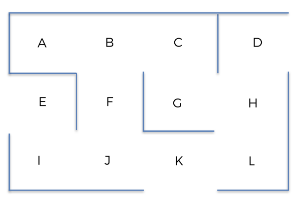

# Q Learning
optimal logistic route with Q_learning. Taken from [Udemy AI course](https://www.udemy.com/course/artificial-intelligence-az/)

# Project objective

Given an environment (logistic warehouse with bin areas to pick up references), find the optimal route from a bin X to a bin Y.

We will use Q Learning algorithm.

Option to include intermediate destinations as constraints

The provided environment is the following:

# Q Learning implementation
we follow these steps to set up the environment:
- define the set of states - Here the different bins from A to L
- define the set of actions - Here the actions are to move to each of the bin, ie from A to L. Note that not all actions are possible from a given locations. Available actions are dictated by the original environment provided
- define the set of rewards - Here, given a location X, we will assign 1 if the action is feasible, 0 if not. The rewards will be registered in a matrix states x actions. We will assign 1000 as a reward to the destination
  - As an example, with current state being A, possible actions are B only. We assign 1 to cell[0,1] of the reward matrix and 0 to the remaining cells of the first row corresponding to state A
  - Now, with current state being B, possible actions are A, C and F. We assign 1 to cell[1,0], cell[1,2], cell[1,5] of the reward matrix and 0 to the remaining cells of the second row corresponding to state B
  - ...
 
# Markov Decision Process
An MDP is defined by the states, the actions, the transition rules and the rewards (SATR)
- We have already defined the states, the actions and the rewards
- let's define the transition rules. Given a state s, we use uniform probability distribution and assign equal probability to each of the possible actions. Each action will have the same chance to be activated

# Policy
Given a state s, we choose the action a that maximizes Q(s,a)

# Algorithm - we precompute all Q values iteratively, repeating the steps below a 1000 times
- we initialize the matrix with all Q values to 0
- we add the big reward to the destination bin
- we precompute all Q values through random iterations:
  - randomly select a state
  - randomly select one of the possible actions (also defining the next state)
  - collect the immediate reward
  - compute the temperal difference using Bellman equation:
    - dt = Reward + gamma x max (Q values for next state) - Q value for state s and action a
  - update Q value for state s and action a by adding learning rate alpha x dt to its value

# Output
With intermediate destinations, we proceed with a MDP on each on the legs

!()[asset/sample_route.png]
